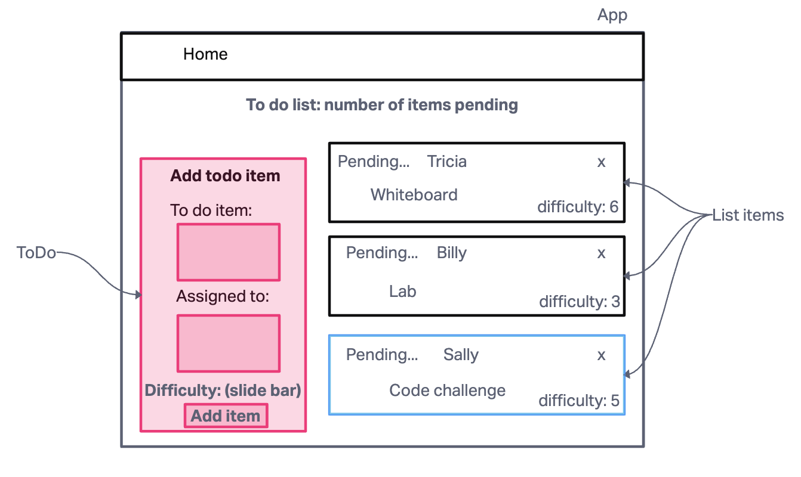

# Lab 31-34

## Project: Context API

### Author: Tricia Sawyer

### Problem Domain

- Lab 31 features

In Phase 1, we’re going to perform some refactoring of a Todo application built by another team. This application mixes application state and user settings at the top level and passes things around. It was a good proof of concept, but we need to make this production ready.

Create a Detailed UML.
Properly modularize the application into separate components, note the proposed file structure below.
Implement the Context API to make some basic application settings available to components.
Show three items by default.
Hide completed items by default.
Add the sort word ‘difficulty’ by default.
Style the application using the Mantine Component API {target:_blank}.
NOTE: The expectation to style this entire component in one day is likely unrealistic. The recommendation is to implement the required functionality, then systematically begin styling with Mantine. Match the comp image(s) as closely as possible. 80% of the design work will likely take 20% of your time. By the end of the week, being mostly there with style is the goal!

- Lab 32 features

In Phase 2, we’re going to extend the functionality of our application by allowing the user to make some decisions on how they would like the application to function. Specifically, we’ll let them make changes to 2 settings.

Implement the Context API to make some basic application settings available to components.
How many To Do Items to show at once.
Whether or not to show completed items.
Hint: if reusing the custom useForm() hook, event validation may be necessary if using any Mantine component other  
than "< TextInput />".

Provide the users with a form where they can change the values for those settings.
This should be given in the form of a new component, perhaps linked to from the main navigation.
Hint: Use Browser Router to create the page/route/component for this.
Once settings are updated, render the updated settings to the right of the “form”. Consider using "< Grid />", "< Card />", and "< When />" components.
Save the users choices in Local Storage.
Retrieve their preferences from Local Storage and apply them to the application on startup.

- Lab 33 features

In Phase 3, we’d like to extend the functionality of the application by requiring users be logged in to view items and also restrict access based on user type. The user stories from Phases 1, and 2 remain unchanged. For this phase, we are now adding the following new user stories.

As a user, I want to provide a way for other users to create new accounts.

As a user, I want to provide a way for all users to login to their account.

As a user, I want to make sure that my To Do items are only viewable to users that have logged in with a valid account.

As a user, I want to ensure that only fellow users that are allowed to “create”, based on their user type, can add new To Do Items.

As a user, I want to ensure that only fellow users that are allowed to “update”, based on their user type, can mark To Do Items complete.

As a user, I want to ensure that only fellow users that are allowed to “delete”, based on their user type, can delete new To Do Items.

- Lab 34 features

In Phase 4, we will finalize the functionality of the application by connecting to live servers for login, authorization, and data access.

Technical Requirements / Notes
Technical requirements for the core application are unchanged from the prior phases, with the addition of Performing actual HTTP requests with an Authenticated API server:

Alter the Add, Toggle Complete, and Delete functions within your to do application to use your API instead of in memory state.
Fetch the current list of items from the database on application start.
Whenever you add/update/delete an item, refresh the state so the user can instantly see the change.
Consider: Do you re-fetch from the server every time you make a change?
If so, how?
If not, how will you stay in sync?
Alter the Login Context to use the server to login users instead of our mock users list.
Be sure to store the token in state as well as in a cookie so you can reference it later.

### Links and Resources

[Code sandbox deployment](https://56gqkc-3000.csb.app/)

[Mantine theming doc](https://mantine.dev/theming/colors/)

[Tabler icons](https://tabler.io/icons)

### Collaborators

Ryan Gallaway in code review for all labs, really helpful! I also used chat gpt to help write some of the tests and debug some issues I was having.

### UML

### Set up

In the project directory, you can run:

#### `npm i` to install dependencies

#### `npm start` to run the application

#### `npm test` to launch the test runner in the interactive watch mode

### Functionality

To check out my webpage, open up my Code sandbox deployment link noted above. You can sign in as an admin, editor, or user, using these logins:

User: `admin`

Pass: `ADMIN`
 
 

User: `editor`

Pass: `EDITOR`
 
 

User: `user`

Pass: `USER`
